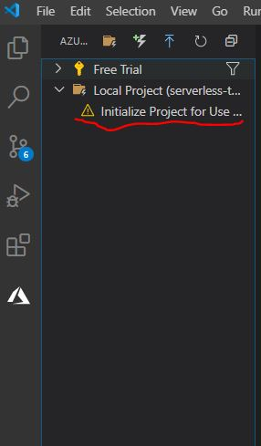
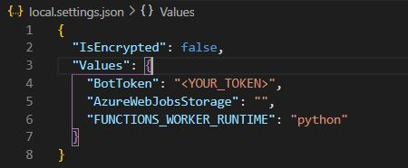
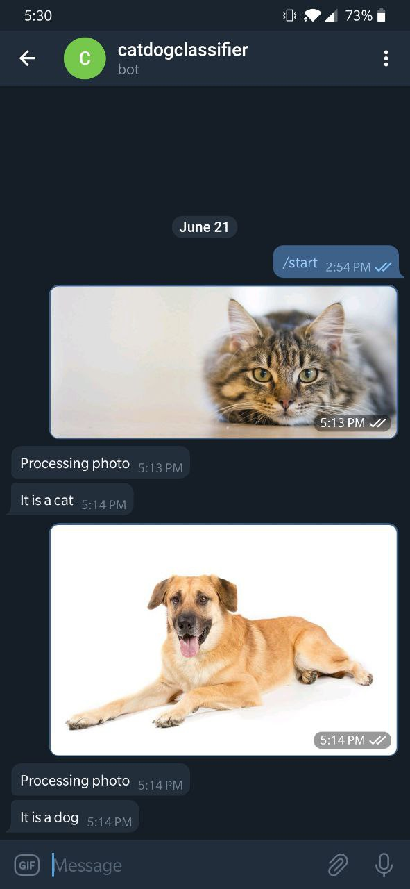
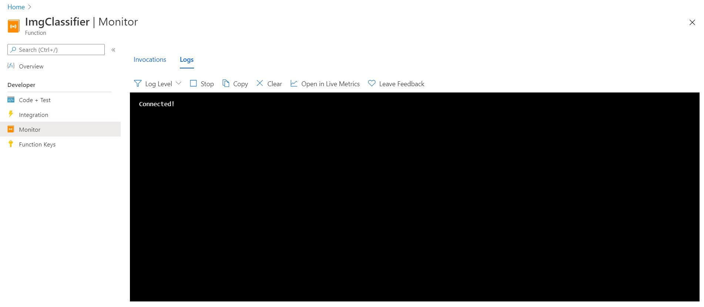

# How To:
Here are the steps needed to deploy your own telegram image classification bot
## Set up vscode and clone repo
1. Install VScode: https://code.visualstudio.com/
2. Install Azure functions extention for VScode: https://docs.microsoft.com/en-us/azure/azure-functions/functions-develop-vs-code?tabs=csharp#install-the-azure-functions-extension
3. Log in to Azure through VScode: https://docs.microsoft.com/en-us/azure/azure-functions/functions-develop-vs-code?tabs=csharp#sign-in-to-azure
4. Fork and clone the repo: `git clone https://github.com/<your_username>/serverless-telegram-image-classification-bot.git`
5. Navigate to the Azure tab and click on Initialize Project for Use:




6. Make `local.settings.json` file under the project folder (serverless-telegram-image-classification-bot) and fill with:
```
{
  "IsEncrypted": false,
  "Values": {
    "BotToken": "<YOUR_TOKEN>",
    "AzureWebJobsStorage": "",
    "FUNCTIONS_WORKER_RUNTIME": "python"
  }
}

```


## Set up telegram bot
1. Create your bot: https://core.telegram.org/bots#3-how-do-i-create-a-bot
2. Change the local.settings.json file in your Azure Function project folder to contain the "BotToken" variable. This should be the token given to you by Botfather in the previous step: 
   


## (OPTIONAL) Personalize
1. Modify `model.pb` and `labels.txt`: You can change these to accomodate your own image classification models
2. Modify prediction: You can go in and play around with the code in `predict.py` and `__init__.py` (i.e. to add image preprocessing)

## Deploy
1. Deploy your function to azure. VScode makes this super easy: https://docs.microsoft.com/en-us/azure/azure-functions/functions-develop-vs-code?tabs=csharp#publish-to-azure
2. Do not forget to push your settings (BotToken) to Azure as well
3. Set up your bot to send requests to your azure function. In order to do this you would need to use setWebhook from the telegram API. Here is a sample of that in windows powershell:
```
Invoke-RestMethod -Uri https://api.telegram.org/bot<YOUR_BOT_TOKEN>/setWebhook -Body @{
    "url"="https://<YOUR_PROJECT_NAME>.azurewebsites.net/api/ImgClassifier?code=<YOUR_AZURE_FUNCTION_CODE>"
} -Method Post
```

## USE
Here is the bot in action:



## MONITOR
1. You can monitor and debug (if necassary) using Azure. All logging levels are displayed in the function logs on azure:

